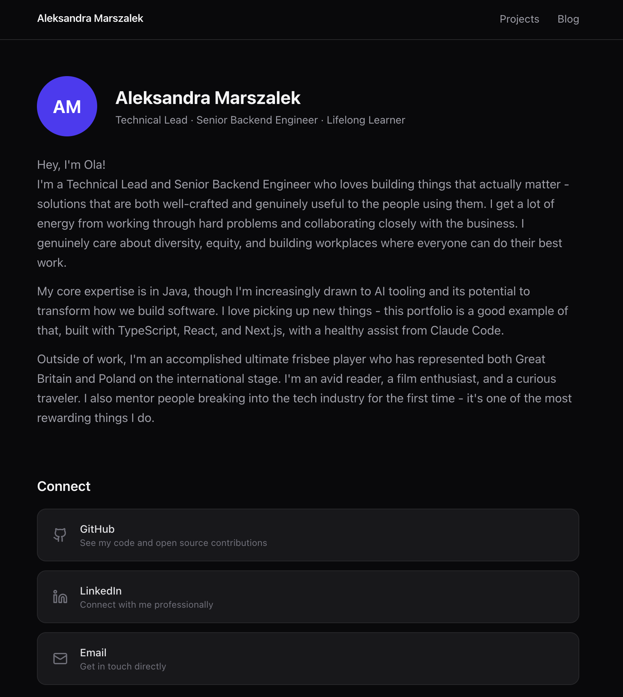

# Portfolio Page

Personal portfolio and blog built with Next.js 16, Tailwind CSS, and MDX. Fast to set up, easy to maintain, no database required.

Built with a healthy assist from [Claude Code](https://claude.ai/code).



## Stack

- **Next.js 16** (App Router) — file-based routing, static generation
- **TypeScript** — throughout
- **Tailwind CSS v4** — styling
- **MDX** via `next-mdx-remote` — blog posts as `.mdx` files
- **gray-matter** — frontmatter parsing
- **lucide-react** — icons

## Project Structure

```
app/                  # Next.js pages (home, /projects, /blog, /blog/[slug])
components/
  layout/             # Navbar, Footer
  sections/           # AboutSection, LinksSection, FeaturedProjects, LatestPosts
  ui/                 # ProjectCard, BlogPostCard, TechBadge
content/blog/         # MDX blog posts
data/projects.ts      # Static project list
lib/
  mdx.ts              # getAllPosts(), getPostBySlug()
  utils.ts            # cn(), formatDate()
types/index.ts        # Project, BlogPostMeta, BlogPost interfaces
```

## Getting Started

```bash
npm install
npm run dev
```

Open [http://localhost:3000](http://localhost:3000).

## Customisation

- **Bio** — edit `components/sections/AboutSection.tsx`
- **Social links** — edit `components/sections/LinksSection.tsx`
- **Projects** — edit `data/projects.ts`
- **Blog posts** — add `.mdx` files to `content/blog/` with this frontmatter:

```yaml
---
title: "Post title"
date: "2026-01-01"
summary: "A short summary shown in the post list."
tags: ["tag1", "tag2"]
published: true
---
```

## Scripts

| Command | Description |
|---|---|
| `npm run dev` | Start dev server |
| `npm run build` | Production build |
| `npm run start` | Start production server |
| `npm run lint` | Run ESLint |
